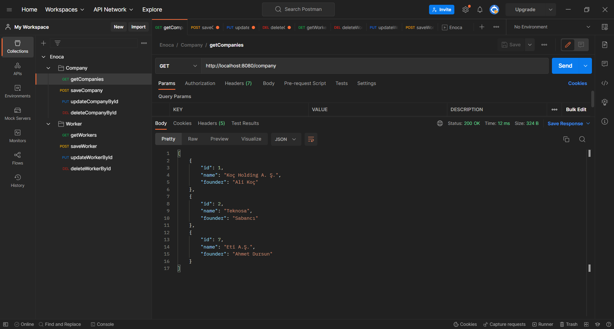

## MVC Dökümanı

Uygulama yaşam döngüsü şu şekilde gerçekleşir.
Ayakta olan web uygulamamıza bir istek geldiğinde,

dispatcher servlet bu isteği ilgili controller methoduna iletir. Buradan ilgili servis veya business katmanına yönlendirme yapılır. Servis katmanında veri erişimi için DAO işlemleri yapılır ve kullanılmak istenilen veri Dto objesi olarak dönülür.
