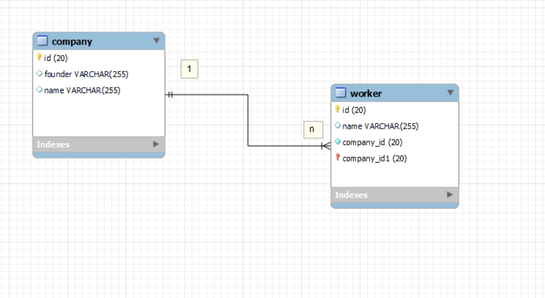
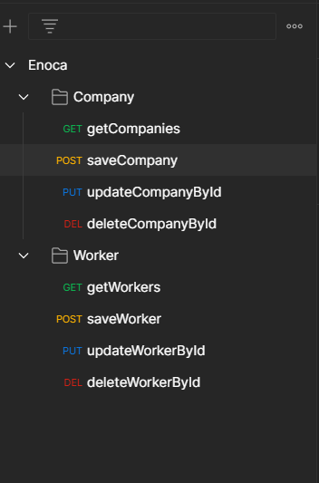

# EnocaCase

This repository includes my answers to pass the case.

## 1- MVC kavramını açıklar mısınız ? Neden ihtiyaç duyuluyor. Java’da nasıl kurgulanıyor. Object Oriented katmanları nelerdir ?

MVC web projeleri geliştirilirken kullanılan bir tasarım kalıbıdır. Projenin daha kolay yönetilebilmesini sağlayarak kod karmaşıklığının önüne geçer.
Mvc 3 temel parçadan oluşur model, view ve controller. Controller gelen isteklerin filtrelenerek ilgili servis classlarına yönlendirildiği kısımdır. Model ve view arasında köprü vazifesi görür. Model, veritabanı erişim işlemlerinin ele alındığı kısımdır. View ise sunum işlemlerinin yapıldığı kısımdır. Controller dan gelen verileri kullanarak işlem yapar.

## 2-Birbirinden bağımsız iki platformun birbiriyle haberleşmesi nasıl sağlanabilir. Örneğin, X platformu Java ile yazılmış olsun, Y platform u C# ile. Bu iki platformun bir biri ile iletişim halinde request-response ilişkisi kurması gerekiyor. Bu yapıyı nasıl sağlarız.

Bu sorunu çözmek için backend uygulamamızın client gibi davranmasını sağlayarak işlem yapmamız gerekiyor. Örneğin Java için konuşacak olursak RestTemplate class'ı ile bu işlemi java tarafında yaptırabiliriz.
C# üzerinde böyle bir uygulama gerçekleştirmedim fakat yaptığım araştırma sonucunda RestSharp kütüphanesi kullanılarak oluşturulan RestClient ile bu işlemi yapabiliriz.

## 3-Bir web sayfasında ekran sürekli Backend’ den veya bir başka yapı tarafından güncelleniyor. Siz, web sayfasını refresh etmeden bu güncel bilgiyi anlık ekrana nasıl yansıtırsınız.

Eğer sayfayı yenilemeden sayfa üzerinde değişiklik yapmak istiyorsak java Script kullanarak değiştirmek istediğimiz elementi document.getElementById ile alırız ve gelen veri ile element içeriğini güncelleriz.

## 4-Yıldız sorusu

    String stars = "";
            for(int i = 1; i <= 10; i++){
                stars += "*";
                if(i == 1 || i % 2 == 0){
                    System.out.println(stars);
                }
            }

## 5- Firmada çalışman için sana remote bir linux server verildi. Elinde ip adresi port bilgisi kullanıcı adi ve şifren var. Server a erişimi nasıl test edersin, Server a nasıl erişirsin, Server a nasıl dosya atarsın, Serverdan nasıl dosya çekersin.

Daha önce böyle bir uygulama yapmamıştım fakat biraz araştırma yaparak SCP ile dosya gönderme alma işlemlerinin yapılabildiğini öğrendim. SCP arka planda SSH kullandığı için güvenli bir yoldur. Fakat bunu kullanabilmek için bilgisayarımızda SSH istemcisinin yüklü olması gerekir.
Dosya göndermek için ise komut satırına:

scp GönderilecekDosya NereyeGönderilecek

scp file.txt remote_username@10.10.0.2:/remote/directory

Eğer istediğimiz port üzerinden işlem yapmak istiyorsak -P komutu ile bu portu belirtmeliyiz:

scp -P 2322 file.txt remote_username@10.10.0.2:/remote/directory

Eğer dosya çekmek istiyorsak:
scp remote_username@10.10.0.2:/remote/file.txt /local/directory

Bu işlemlerden sonra bizden parola isteyecek ve doğru girdiğimizde işlemimizi gerçekleştirecek.

[Linux Server Source](https://linuxize.com/post/how-to-use-scp-command-to-securely-transfer-files/)

## 6- Mvc Dökümanı hazırlayınız

[Mvc Document](./MvcDocument/README.md)

## 7- Apache Solr servisine yazılacak bir query örneği Apache Solr kullanılan sql programlarından daha farklı runtime bir database. Solr a hali hazırda kayıtlı bir alan olduğunu düşünelim. Alanın ismi “updatedAt” long tipinde tutulan bir alan. Ben 2020 Ocak ayından sonraki verileri getir dediğimde solr a nasıl bir query yazılmalı. http://example?query= kısmını nasıl doldurmalıyım?

Daha önce Apache Solr sorgusu yazmamıştım. Solr dökümanını incelediğimde sorunu query'i filtrelereyek çözebileceğimi gördüm.
Bunun için yapılması gereken query yerine filter query anlamına gelen "fq" komutunu kullanmak:

Http://example?fq=year:[2020 TO *]

şeklinde yazabiliriz.

Eğer sorguyu devam ettirmek istersek, sorgu devamına &fq=condition şeklinde devam edebiliriz.

[Apache Solr Source](https://solr.apache.org/guide/6_6/common-query-parameters.html)

##

##
[POSTMAN](./Enoca.postman_collection.json)